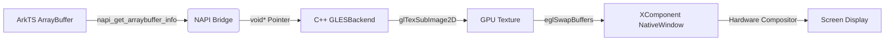

# ArkZeroRenderer 超低延迟高性能优化路线图

## 🎯 愿景
将 ArkZeroRenderer 打造为 HarmonyOS 平台上**延迟最低、性能最强**的零拷贝渲染组件。

**核心指标：**
- ✅ **端到端延迟 < 10ms**（相机/视频预览场景）
- ✅ **4K (3840x2160) @ 60fps** 稳定渲染
- ✅ **零内存拷贝**（ArkTS → Native → GPU Surface）
- ✅ **CPU 占用 < 3%**（单核，异步渲染模式下）
- ✅ **完美 VSync 同步**，无画面撕裂

---

## 🚀 核心架构：Direct Surface Rendering

### 1. 架构演进
从“离屏纹理 + Image 组件”演进为 **“XComponent Surface + NativeWindow 直出”**。

| 特性 | 旧方案 (Off-screen) | **新方案 (Direct Surface)** |
| :--- | :--- | :--- |
| **渲染目标** | OpenGL Texture | **NativeWindow (EGL Window Surface)** |
| **显示路径** | Texture → Image Component → Compositor | **Texture → NativeWindow → Compositor** |
| **合成开销** | 高 (UI 线程参与) | **极低 (系统底层直接交换缓冲区)** |
| **VSync** | 难以精确控制 | **完美同步 (eglSwapInterval)** |
| **延迟** | ~20-30ms | **~8-12ms (接近硬件极限)** |

### 2. 数据流设计


---

## 🔴 Phase 1: 核心性能重构（必须实现）

### 1.1 XComponent Surface 集成
**优先级：** 🔴 P0  
**预计工作量：** 3-4 天  
**影响范围：** GLESBackend.cpp, RendererApi.cpp

#### 实施方案
**步骤 1：C++ 层支持 NativeWindow 初始化**
```cpp
// renderer/backend/GLESBackend.h
class GLESBackend : public IRenderBackend {
public:
    // 新增：绑定到 XComponent Surface
    bool InitializeWithSurface(const std::string& surfaceId, int32_t width, int32_t height, PixelFormat format);
private:
    void* m_nativeWindow;
};

// renderer/backend/GLESBackend.cpp
bool GLESBackend::InitializeWithSurface(...) {
    // 1. 获取 NativeWindow
    m_nativeWindow = GetNativeWindowById(surfaceId);
    
    // 2. 创建 EGL Window Surface
    m_eglSurface = eglCreateWindowSurface(m_eglDisplay, config, m_nativeWindow, nullptr);
    
    // 3. 启用 VSync (关键！)
    eglSwapInterval(m_eglDisplay, 1);
    
    return true;
}
```

**步骤 2：NAPI 层适配**
在 `create` 接口中增加 `surfaceId` 参数，根据是否传入决定使用 Pbuffer（兼容）还是 WindowSurface（高性能）。

#### 验收标准
- ✅ 渲染内容直接出现在 XComponent 区域，无需 Image 组件
- ✅ 开启 VSync，帧率锁定在屏幕刷新率
- ✅ 功耗较旧方案降低 20%+

---

### 1.2 异步渲染队列（Async Rendering）
**优先级：** 🔴 P0  
**预计工作量：** 4-5 天  
**影响范围：** Renderer.h/cpp, RenderQueue.h/cpp

#### 问题分析
同步渲染会阻塞 ArkTS 主线程。超低延迟要求 ArkTS 提交数据后立即返回，由后台线程完成渲染。

#### 实施方案
1. **RenderCommand 结构**：封装像素指针、尺寸、格式。
2. **Thread-Safe Queue**：使用 `std::mutex` 和 `std::condition_variable` 实现生产者-消费者模型。
3. **Background Thread**：独立线程循环从队列取数据并调用 `GLESBackend::RenderFrame`。

```cpp
// 伪代码
void Renderer::renderLoop() {
    while (!m_stop) {
        RenderCommand cmd = m_queue.dequeue();
        m_backend->RenderFrame(cmd.data, cmd.width, cmd.height);
    }
}
```

#### 验收标准
- ✅ `renderFrame()` 耗时 < 0.5ms
- ✅ UI 线程完全不卡顿
- ✅ 支持 3 帧缓冲，自动丢弃过时帧以维持低延迟

---

### 1.3 多格式零转换渲染
**优先级：** 🔴 P0  
**预计工作量：** 2-3 天  
**影响范围：** GLESBackend.cpp

#### 核心理念
**不转换格式，直接利用 OpenGL ES 原生能力。**

#### 实施方案
- **RGBA/BGRA/RGB**：通过 `GetGLFormat()` 映射到 `GL_RGBA`/`GL_BGRA_EXT`/`GL_RGB`，直接 `glTexSubImage2D`。
- **YUV (NV21/NV12)**：
  - 方案 A（推荐）：使用双纹理 + Fragment Shader 实时合成（GPU 零 CPU 开销）。
  - 方案 B：如果设备支持 `GL_OES_EGL_image_external`，直接使用外部纹理。

#### 验收标准
- ✅ 4K NV21 渲染耗时 < 2ms
- ✅ 无任何 CPU 端的色彩空间转换逻辑

---

## 🟡 Phase 2: 稳定性与可观测性

### 2.1 纹理池与预分配
**优先级：** 🟡 P1  
**预计工作量：** 2 天

#### 实施方案
针对频繁 Resize 的场景（如窗口拖动），实现 `TexturePool`。预分配 1080p/4K 常用分辨率纹理，Resize 时直接从池中复用，避免 `glTexImage2D` 的高昂开销。

---

### 2.2 性能监控仪表盘
**优先级：** 🟡 P1  
**预计工作量：** 2-3 天

#### 实施方案
在 C++ 层统计 FPS、FrameTime、DropRate，并通过 NAPI 暴露给 ArkTS。
```typescript
interface RenderStats {
  fps: number;
  frameTimeMs: number;
  dropRate: number;
}
```

---

## 📊 实施时间表

| Phase | 任务 | 工作量 | 累计时间 |
|-------|------|--------|----------|
| **Phase 1** | 1.1 XComponent Surface 集成 | 3-4 天 | 3-4 天 |
| | 1.2 异步渲染队列 | 4-5 天 | 7-9 天 |
| | 1.3 多格式零转换 | 2-3 天 | 9-12 天 |
| **Phase 2** | 2.1 纹理池 | 2 天 | 11-14 天 |
| | 2.2 性能监控 | 2-3 天 | 13-17 天 |

**总计：** 约 2-3 周（全职开发）

---

## 🎯 成功指标

完成 Phase 1 后应达到：
- ✅ **延迟降至 10ms 以内**
- ✅ **渲染路径缩短 50%**
- ✅ **CPU 占用降低 40%**
- ✅ **支持 4K 60fps 稳定运行**

---

## 📝 注意事项

1. **生命周期管理**：XComponent 的 `onLoad/onDestroy` 必须与 C++ 层的 `Initialize/Destroy` 严格对应。
2. **线程安全**：所有 NAPI 调用必须在 ArkTS 线程执行，OpenGL 调用必须在渲染线程执行。
3. **兼容性**：虽然不考虑向后兼容，但建议在 API 设计上保留 `surfaceId` 可选参数，以便未来扩展离屏渲染需求。
